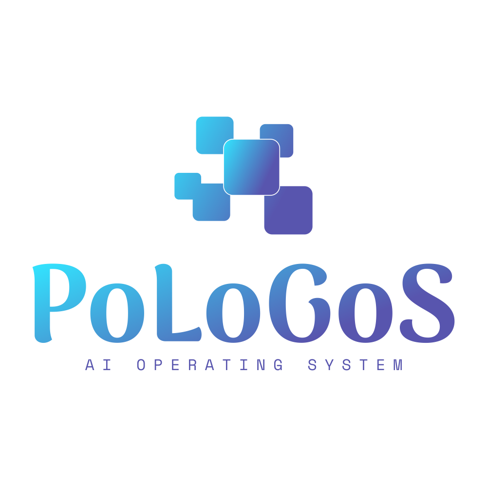

# [logo.pologos.com](https://logo.pologos.com/)

font name: ArimaKoshi-Bold
font link: https://fonts.google.com/specimen/Arima+Madurai
font author: NDISCOVER
font author site: http://www.ndiscovered.com/

icon designer: Marie Van den Broeck
icon designer link: /marie49
        

fontColor: {"gradient-0":"#32E5FF","gradient-1":"#5855AE"}
bgColor: {"hex":"transparent"}
iconColor: {"gradient-0":"#32E5FF","gradient-1":"#5855AE"}

## Colors

Font 

    #32E5FF, #5855AE

Background

    transparent

Icon

    #32E5FF, #5855AE    

## 1
[https://logo.pologos.org/1/cover.png](https://logo.pologos.org/1/cover.png)

## 2
[https://logo.pologos.org/2/cover.png](https://logo.pologos.org/2/cover.png)

## 3
[https://logo.pologos.org/3/cover.png](https://logo.pologos.org/3/cover.png)

## 4
[https://logo.pologos.org/4/cover.png](https://logo.pologos.org/4/cover.png)

---

+ [edit](https://github.com/pologos/logo/edit/main/README.md)
+ [pologos/logo/](https://github.com/pologos/logo/)
